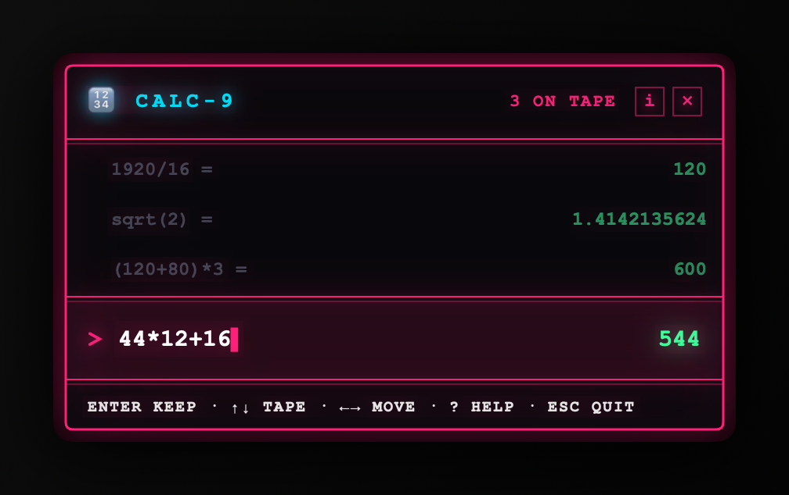
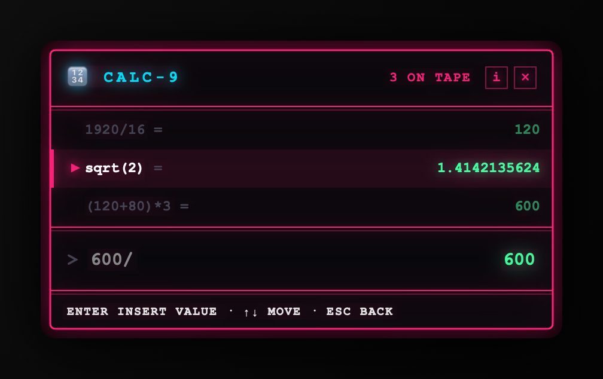
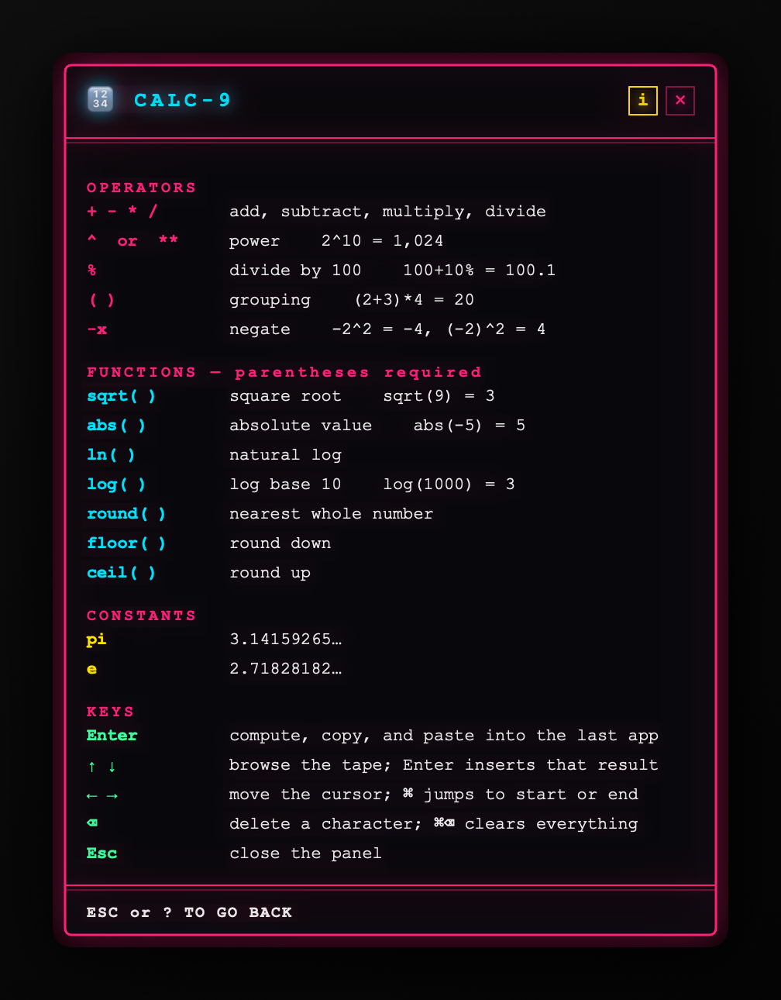

# Calc-9

A menu bar calculator for macOS. Press **Cmd+Option+9**, type an expression, watch the
result update as you type, and press Enter — the answer is pasted into whatever app you
were using.

Sibling to [Clip-9](https://github.com/monacotobi/clip-9), and it looks the part.

<p align="center">
  
</p>

The result updates as you type, and it shows the **longest valid prefix** — so `44*12+`
already reads 528 while you are still deciding what comes next, rather than blanking out
on every operator.

### Press ↑ to reuse an earlier result

<p align="center">
  
</p>

The expression field dims while you browse, so it is obvious where your keystrokes are
going. Enter drops the selected value into whatever you were building.

### Press i, or ?, for everything it can do

<p align="center">
  
</p>

## Install

1. Download `Calc-9.zip` from the [latest release](../../releases/latest) and unzip it.
2. Move `Calc-9.app` to Applications.
3. **Right-click the app and choose Open** the first time — the build is unsigned, so macOS
   warns that the developer cannot be verified.
4. Grant Accessibility when asked. See below for exactly what it is for.

Or build it yourself; it is one command.

## Usage

Two focus modes: the **expression field**, and the **tape**.

| Key | In the field | In the tape |
|---|---|---|
| `0-9 . + - * / % ( )` | type | jump back to the field and type |
| `↑` | enter the tape | move to older entries |
| `↓` | — | move newer; past the end returns to the field |
| `Enter` | compute, copy, paste, close | insert that result into your expression |
| `Backspace` | delete a character | return to the field |
| `Cmd+Backspace` | clear | — |
| `Esc` | close | return to the field |

So `600/` then `↑` `Enter` pulls an earlier result into the expression you are building.

Open it with the hotkey, by clicking the menu bar icon, or by launching the app. **Launch at
Login** is in the menu bar item.

### Arithmetic

`+ - * /`, parentheses, decimals, and unary minus. Left-associative, normal precedence.

**`%` divides by 100 and nothing else.** `50%` is `0.5`, and `100+10%` is `100.1` — *not*
`110`. Phone calculators make `%` mean "of the preceding term" inside an addition; that
cannot be expressed in a precedence table and behaves unpredictably in a field that
re-evaluates on every keystroke. If you want `110`, write `100*1.1`.

Named functions like `sqrt` are not supported yet.

## Why it needs Accessibility

**Only to paste.** macOS puts synthetic keystrokes behind Accessibility, and pressing Enter
sends a Cmd+V to the app you came from.

If you decline, Calc-9 still works: the hotkey opens the panel and results are copied to
your clipboard. You just paste them yourself.

The **hotkey needs no permission at all.** Calc-9 registers one key combination with the
system through `RegisterEventHotKey`, so it is told when Cmd+Option+9 is pressed and can see
nothing else. It does not install a keyboard event tap and cannot observe your typing.
See [`Sources/HotKey/HotKeyManager.swift`](Sources/HotKey/HotKeyManager.swift).

## Privacy

- The tape holds three entries **in memory only**. Nothing is written to disk.
- Quitting clears it.
- **No network access at all** — no analytics, no telemetry, no update check.

## Build from source

Requires Xcode 15+ and macOS 13+.

```sh
git clone https://github.com/monacotobi/calc-9.git
cd calc-9
open Calc-9.xcodeproj      # then Cmd+R
```

From the command line:

```sh
xcodebuild -project Calc-9.xcodeproj -target Calc-9 -configuration Release \
           CONFIGURATION_BUILD_DIR="$PWD/build" CODE_SIGN_IDENTITY="-" build
```

### Tests

```sh
swift test
```

The expression engine is pure Swift with no AppKit, so it is tested without a window server.
`Package.swift` exists only for that: it exposes `Sources/Engine` as a library so the
tokenizer, parser, evaluator and tape can be tested directly. The app target compiles the
same files — nothing is duplicated, and the tests cover exactly the code that ships.

The UI, hotkey and paste are not unit tested; they need a real window server and a real
keyboard.

### Screenshots

The images above are generated, not captured:

```sh
./Tools/render-screenshots.sh
```

It compiles the actual `CalcView` and draws it with `ImageRenderer`, so the README shows
the same code that ships and cannot quietly go stale. Re-run it after any UI change.

## Limitations

- Three tape entries, not persisted
- No named functions, variables, or unit conversion
- The hotkey is fixed at Cmd+Option+9
- Releases are unsigned

## License

MIT. See [LICENSE](LICENSE).
